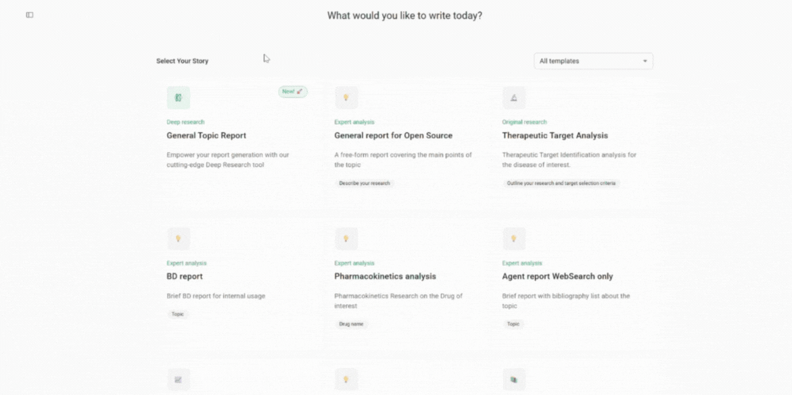

# DORA User Manual

**Version**: 1.0

**Last Updated**: Dec 30, 2025

## 💡 Overview

**DORA (Document Oriented Research Assistant)** is an AI-driven assistant that helps users create structured research outputs, such as review articles, reports, and proposals. The **Open Source edition** empowers developers, analysts, and researchers to:

- Build and test custom generation templates

- Integrate external tools like web search

- Define document structure and control section logic

- Use shared memory and inter-section dependencies


## 📦 Installation


Make sure you also configure environment variables and any necessary API keys for optional tools (e.g., scientific search APIs).
Please refer to the `.env.example` to create a `.env` file, filling in your own keys.


## 🐳 Local Setup Using Docker

To run DORA locally with the web interface:

```
git clone git@github.com:insilicomedicine/DORA.git
```

Follow the [README](https://github.com/insilicomedicine/DORA) for detailed instructions about how to start the services.


## 🚀 Run Document Generation (in the Web Interface)


### 1. Navigate to the Template Dashboard

Once logged in, go to your selected template's page.

### 2. Set Goals and Provide Inputs

Fill out each input field. Be clear and descriptive — avoid abbreviations where possible to improve AI understanding.

### 3. Upload Custom Data (Optional)

- Add your own datasets, pre-written paragraphs, selected publications, or key findings to specific sections.

- Upload PDFs containing source content that DORA can reference during generation for the defined topic.

### 4. Enable Tools (Optional)

- For some templates, you can enable Resources/Team of Agents such as Web Search.

- Toggle tools on/off in the section settings to customize the data sources DORA will use.

### 5. Review or Edit the Research Plan

- Before starting, press "Auto-Fill Plan" to explore the document structure.

- You can customize the plan by adding tasks, changing the order, or removing irrelevant steps.

### 6. Start Generation

- Click the "Generate" button in the top-right corner of the document generation page.

- DORA will process your inputs, template logic, and any enabled tools to begin writing.

- You will see progress bars for each section as they are being generated.

### 7. Wait for Completion

- Document generation typically takes 10-20 minutes, depending on complexity and enabled tools.
- Once completed, all sections will become editable.

### 8. Review Your Draft

- Explore the generated visual summary.
- Read through the generated content and make manual edits.
- Make inline edits or use AI Actions such as Summarize, Extend, or Improve for refinement.
- Add citations or references, utilizing tools such as Web Search.
- Apply AI review in the Review Insights panel.
- Export the document to PDF or Word format.


## 🚀 Deep research

### Purpose
Enable in-depth technical exploration, helping users analyze complex topics, review scientific literature, and generate detailed insights beyond conventional AI chat capabilities.

### Setup Instructions

To enable the Deep Research service, follow these steps:

  1. **Create Azure AI Foundry Project**

    - Ensure you have created an `o3-deep-research` project in Azure AI Foundry
    - The project must be set up in supported regions (West US or Norway East)
    - Deploy the required models: `o3-deep-research` and `gpt-4o`
    - Connect a Grounding with Bing Search resource
    - For detailed setup instructions, refer to: [Microsoft Azure AI Foundry Deep Research Documentation](https://learn.microsoft.com/en-us/azure/ai-foundry/agents/how-to/tools/deep-research?view=foundry-classic)

  2. **Configure Environment Variables**

    - Reference the "Azure AI Agent Deep Research" section in `.env.example`
    - Add the corresponding configuration settings to your `.env` file
    - Ensure all required connection strings and API keys are properly configured

  3. **Enable in Admin Portal**

    - Navigate to the admin portal
    - Locate the "Deep research" template type
    - Check the "Is Online" option to activate the template

**User Manual:**

