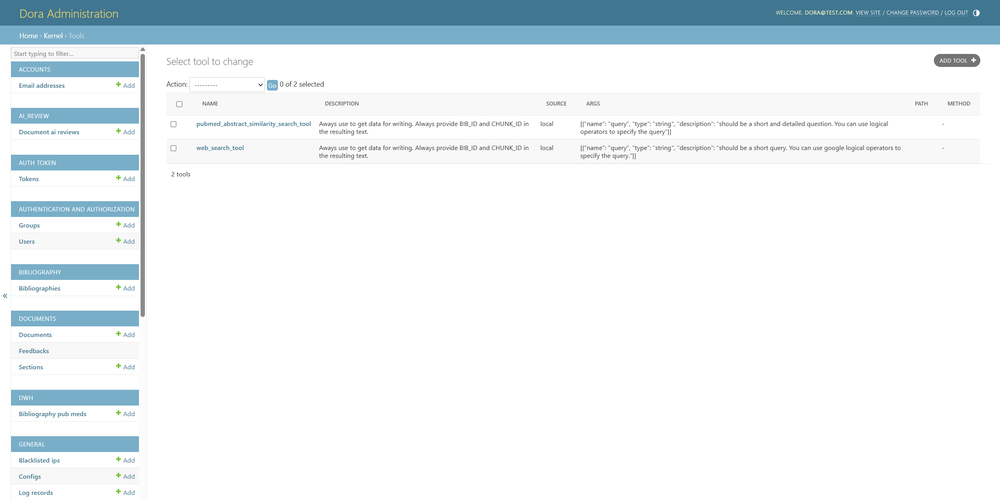
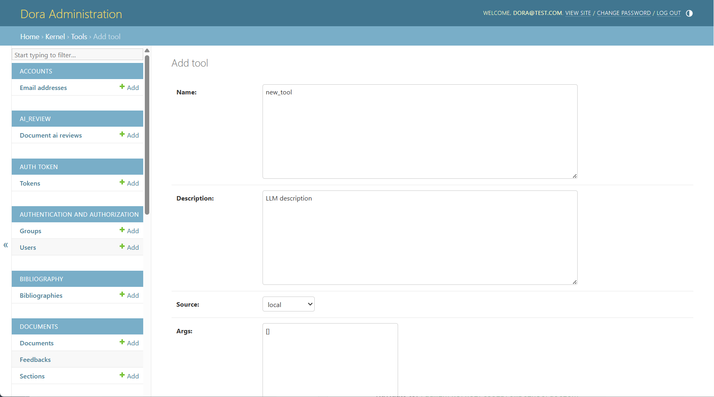
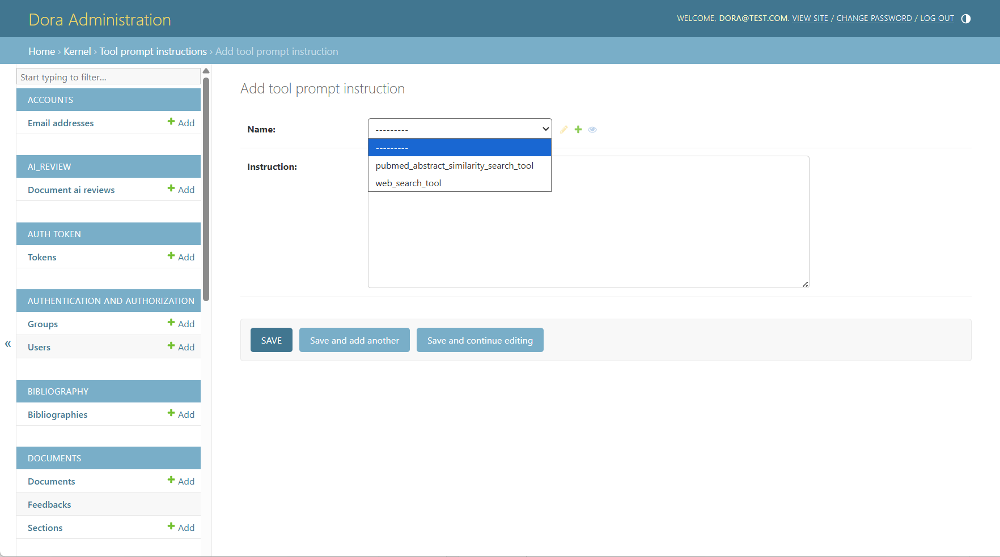
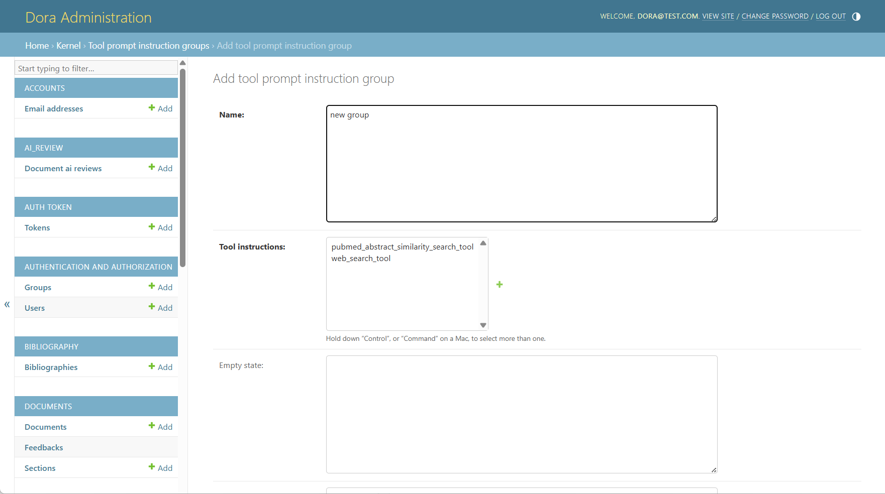
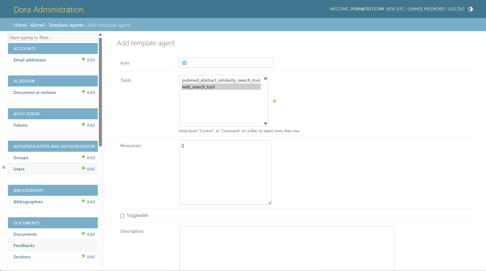
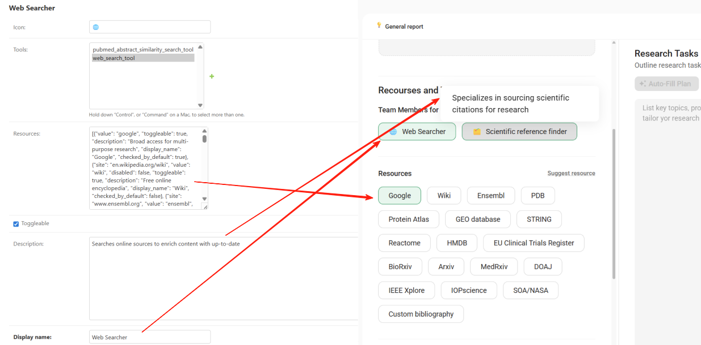
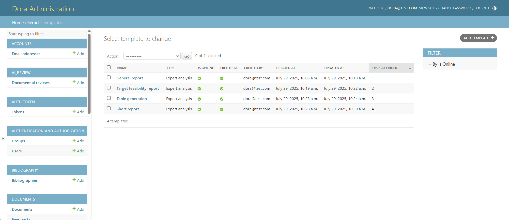
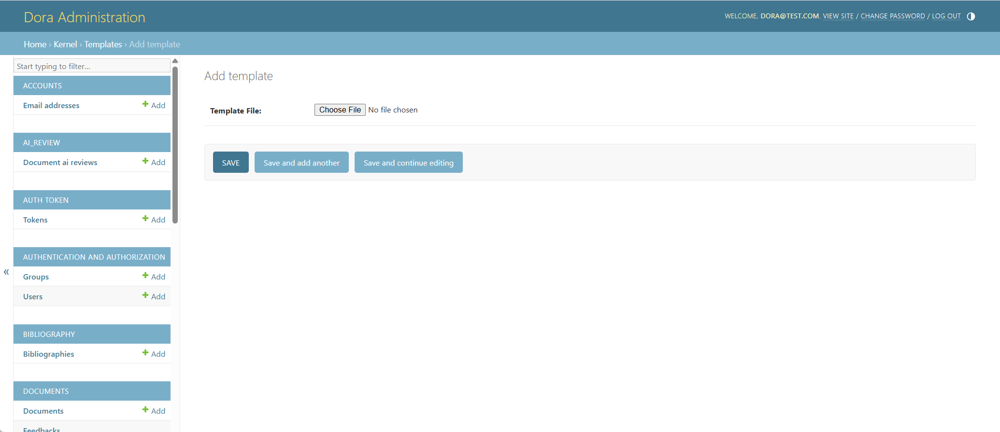
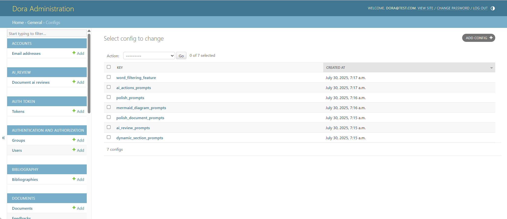

# DORA User Manual

**Version**: 1.0

**Last Updated**: July 30, 2025

## 💡 Overview

**DORA (Document Oriented Research Assistant)** is an AI-driven assistant that helps users create structured research outputs, such as review articles, reports, and proposals. The **Open Source edition** empowers developers, analysts, and researchers to:

- Build and test custom generation templates

- Integrate external tools like web search

- Define document structure and control section logic

- Use shared memory and inter-section dependencies


## 📦 Installation


Make sure you also configure environment variables and any necessary API keys for optional tools (e.g., scientific search APIs).
Please refer to the `.env.example` to create a `.env` file, filling in your own keys.


## 🐳 Local Setup Using Docker

To run DORA locally with the web interface:

```
git clone git@github.com:insilicomedicine/DORA.git
```

Follow the [README](https://github.com/insilicomedicine/DORA) for detailed instructions about how to start the services.


## 🚀 Run Document Generation (in the Web Interface)


### 1. Navigate to the Template Dashboard

Once logged in, go to your selected template's page.

### 2. Set Goals and Provide Inputs

Fill out each input field. Be clear and descriptive — avoid abbreviations where possible to improve AI understanding.

### 3. Upload Custom Data (Optional)

- Add your own datasets, pre-written paragraphs, selected publications, or key findings to specific sections.

- Upload PDFs containing source content that DORA can reference during generation for the defined topic.

### 4. Enable Tools (Optional)

- For some templates, you can enable Resources/Team of Agents such as Web Search or Publication Finder.

- Toggle tools on/off in the section settings to customize the data sources DORA will use.

### 5. Review or Edit the Research Plan

- Before starting, press "Auto-Fill Plan" to explore the document structure.

- You can customize the plan by adding tasks, changing the order, or removing irrelevant steps.

### 6. Start Generation

- Click the "Generate" button in the top-right corner of the document generation page.

- DORA will process your inputs, template logic, and any enabled tools to begin writing.

- You will see progress bars for each section as they are being generated.

### 7. Wait for Completion

- Document generation typically takes 10-20 minutes, depending on complexity and enabled tools.
- Once completed, all sections will become editable.

### 8. Review Your Draft

- Explore the generated visual summary.
- Read through the generated content and make manual edits.
- Make inline edits or use AI Actions such as Summarize, Extend, or Improve for refinement.
- Add citations or references, utilizing tools such as Web Search.
- Apply AI review.
- Export the document to PDF or Word format.

## 🛠️ Add a New Tool in DORA from Admin page

To add a new tool in DORA and enable its use in template-based document generation, you need to update several components in the admin panel. Follow these steps:

### 1. Define the Tool

**Navigate to:** /admin/kernel/tool/



In this section:

- Click the **Add tool** button to create a new tool entry. Ensure the tool **name** entry exactly matches the implementation name used in the DORA codebase.
- Provide a clear **description** of the tool for LLMs — this helps the language model understand the tool's purpose and how it can assist in generation.
- Set the **Source** to "local" to indicate that the tool is handled in the local DORA environment (instead of with MCP).
- Define the **argument schema** required by the tool, including all necessary input fields.
- Skip the **Path** and **Method** fields — these are only required for tools executed via the MCP server.



### 2. Add Tool Instructions

**Navigate to:** /admin/kernel/toolpromptinstruction/



This step enables dynamic insertion of tool instructions into prompt templates.

- Click the **Add Tool Prompt Instruction** button to create a new instruction entry for the tool.
- These instructions will be **automatically injected** into the template prompt when:
  - The tool is specified in a section within the template.
  - The user chooses the template and selects the tool in the interface to generate a document.

### 3. Add the Tool to a Tool Group (Prompt Design and Selection)

**Navigate to:** /admin/kernel/toolpromptinstructiongroup/

DORA dynamically integrates tools into prompt templates using **placeholder-based substitution**. In this section:

- **Add the tool** to an existing tool group (e.g., `scientific_search_tools`) or **create a new group** by clicking the "Add tool prompt instruction group" button.
- Add an **"empty state" message**, which will be displayed in the prompt when no tools from the group are selected.



Add the **name placeholder**: `{activated_tools|group_name|names}`

- → Inserts a list of active tool names into the prompt.

Add the **instruction placeholder**: `{activated_tools|group_name|instructions}`

- → Inserts the combined instruction texts from all active tools in the group.

- These placeholders are dynamically replaced during generation based on the selected tools.

- This section also controls **tool visibility and toggling** in the user interface, also known as the Resources and Team of Agents.

#### Prompt Placeholder Example

**Before substitution:**

>Use {activated_tools|scientific_search_tools|names} when needed.
>
>{activated_tools|scientific_search_tools|instructions}

**After substitution (with tools enabled):**

>Use pubmed_abstract_similarity_search_tool and web_search_tool when needed.
>
>Instructions for pubmed_abstract_similarity_search_tool: 1. Questions to the pubmed_abstract_similarity_search_tool should...
>
>Instructions for web_search_tool: 1. Questions to the web_search_tool should be short and...

#### Validation Rules

- `{...|names}` and `{...|instructions}` **must always appear together**.

- All tools listed must:
  - Exist in `/admin/kernel/tool/`
  - Have a valid instruction in `/admin/kernel/toolpromptinstruction/`
- If a prompt uses placeholders, at least **one tool in the group must be selected** for successful substitution.

### 4. Configure Tool Group Display and Visibility in UI

**Navigate to:** `/admin/kernel/templateagent/`



This configuration controls how tools appear in the interface. To display a tool or group of tools in the UI:

- Add an **emoji** for visual grouping (optional but recommended).

- Set a **display name** and provide a **clear description**.

- Attach the relevant **tool(s)** to the agent.

- This allows users to **toggle tools on/off** directly from the interface when configuring generation.



### 5. Final Step: Add Tool to Template Configuration

To enable tool execution during generation, the new tool must be added to the corresponding section(s) of the **template configuration**, which is described in the **DORA Configuration File**.

**See also:** _DORA Configuration File – Section Object → tools key_

1. Open the target template in the Admin panel.

2. Locate the `tools` key inside the desired **section** object.

3. Add the **tool name** to the list of tools for that section.

You can assign the tool to:

- A **specific section** of the template, or

- **All sections**, depending on its scope and relevance.

#### 🧩 Example Template Section Snippet (from DORA Configuration File)

```
{
    "section_name": "Background",
    "tools": [
        "web_search_tool",
        "your_new_tool_name"
    ]
}
```

Each section's configuration is stored in the JSON structure described in the **DORA Configuration File**, where `section_name`, `tools`, `input`, and other properties define how the model operates on that section.

Once this step is complete, your new tool will be fully integrated into the DORA generation system and ready for use by end users.

## 🧪 Load custom Template

To load a custom template into the system, follow these steps:

**1. Access the Admin Panel**

- Go to `/admin`

- Log in using the superuser credentials you created earlier.

**2. Load or Create a Template**

You have two options:

### Option A: Use Predefined Templates and Modify the Config

- In the Admin panel, navigate to Templates under the Kernel section.

- Check if any default templates are available.

- Select a template and adjust the configuration as needed.



### Option B: Create Your Own Template

1. Navigate to `/admin/kernel/template/` and click "Add Template".



2. Upload your .json configuration file.

>    💡 Ensure the JSON structure is correct. You can validate it using [https://jsoneditoronline.org](https://jsoneditoronline.org).

3. Click "Save" and wait for the system to validate your template.

4. Once validated, make the template available for use:
    - Return to the template list at `/admin/kernel/template/`.

    - Select your template.

    - Enable the "Is online" checkbox.

5. (Optional) Set the display order of your template on the selection page using the "Order" field.

## DORA prompts for LLM features



### 🟢 Configs for Document generation

#### 1. dynamic_section_prompts

**Purpose:**
Enables dynamic section creation and detailed prompt generation from a user-defined Research Plan. When enabled (`"dynamic_section_prompts": true` in the template configuration), DORA intelligently splits a research plan into meaningful sections, each with its own title, logic, and generation instructions.

**How it works:**

- The `generate_sections_template` guides the system to analyze the Research Plan and divide it into major thematic sections.

- For each section, the LLM system generates:
  - `slug`: a short, URL-safe identifier

  - `title`: human-readable section name

  - `depends_on`: list of section slugs this section depends on

  - `tools`: list of tools required to generate this section

  - `prompt`: detailed, step-by-step instructions for generation

  - `expected_output_instructions`: guidelines on how the output should be formatted (e.g., length, structure)

- The `separate_custom_data_template` is used to distribute optional CUSTOM TEXT across the generated sections. This ensures all external data is correctly matched to the most appropriate section by content similarity.

**When to use:**
When the document structure is unknown in advance and should be derived from the research plan.

#### 2. word_filtering_feature

**Purpose:**
Performs post-processing of generated sections to eliminate predefined blacklisted phrases and improve human-like quality and natural language fluency, especially for final polishing before document delivery.

**How it works:**

- The prompt instructs the model to act as a university professor refining a draft.

- It preserves structure, citations, and formatting while replacing or removing phrases such as:
  - "In conclusion", "Moreover", "Extremely", etc.

- If a section contains fewer than 3 sentences, the system will leave it unchanged.

- The refined version must maintain:
  - All original citations

  - Section formatting (e.g., lists, bold)

  - Coherent and professional tone

  - No blacklisted phrases

**When to use:**
As a quality control step after section generation to align the tone and language with academic writing standards.

#### 3. polish_document_prompts

**Purpose:**
Refines the entire document structure and wording in JSON format to improve flow, coherence, and readiness for academic publication.

**How it works:**

- Operates on the results key of each section/subsection within a JSON structure.

- Enhances:
  - Sentence flow
  - Section transitions
  - Scientific clarity
  - Language sophistication

- Strict rules enforced:
  - No repetition of facts or sentences
  - Avoids banned phrases (e.g., "In summary", "Delve", "Overall")
  - Explains abbreviations only once
  - Maintains all citation formats and placements
  - Avoids starting multiple paragraphs with the same word

**When to use:**
In the final step of document generation to ensure text is polished, logically cohesive, and meets publication standards.

#### 4. mermaid_diagram_prompts

**Purpose:**
Generates or edits a **Mermaid.js** diagram to visually summarize the document content, typically in the form of a flowchart or graphical abstract.

**How it works:**
This configuration includes several prompts for different use cases:

- `summary_prompt`: Extracts key relationships, mechanisms, and workflows from the full document and creates a structured summary for flowchart generation.
- `assistant_prompt`: Converts the summary into Mermaid.js code, applying visual and semantic formatting guidelines (e.g., pastel colors, scientific layout).
- `diagram_reviewer_prompt`: Validates and corrects Mermaid.js syntax.
- `summary_prompt_detailed`: Offers more structured and section-based summarization for advanced diagrams.
- Other prompts (e.g., `system_prompt_for_mermaid_*`) are used to generate diagrams of different types (flowchart, timeline, state diagram, etc.) with design constraints and hierarchy.

**When to use:**
To produce graphical abstracts or visual summaries to accompany scientific documents, especially useful for publication or presentation.

### 🧩 Other LLM-Related Features

This section provides a detailed overview of the configuration schemas used to support additional LLM-based features in the DORA platform, including:

1. `polish_prompts` – for text polishing after user edits.
2. `ai_actions_prompts` – for editing highlighted text (shorten, extend, or custom actions).
3. `ai_review_prompts` – for automated quality evaluation of generated scientific documents.

#### 1. Polish_prompts

**Purpose:**

The `polish_prompts` configuration defines how the LLM should rewrite a section of a scientific document after a user has manually edited it, focusing on improving grammar, coherence, style, and alignment with prior sections of the document.

**Usage Scenario:**

When the user manually changes a section and wants to "Polish" the updated text using LLM assistance.

**Configuration Schema:**

```
{
    "human_message": "Write the {title} section using the Initial draft.\\n### Initial draft\\n{customized_section_results}\\n\\nMain Instructions:\\n1. Determine if there are Prior sections ... \[truncated for brevity\]",
    "system_message": "You are a scientific writer. You are given the draft of the initial section. Your task: ... \[truncated for brevity\]"
}
```

**Key Highlights:**

- **Conditional Logic**: Behavior changes based on the presence/absence of prior sections.
- **Strict Citation Retention**: Must retain citations if present.
- **Format Preservation**: Maintains original structure (e.g., plain text or subsections).
- **Coherence Enforcement**: Uses prior sections as the "source of truth" to adjust the draft.

#### 2. Ai_actions_prompts

**Purpose:**

Handles user-invoked edits on highlighted text segments within the document. Supported actions include:

- make_longer: Extend the text with more details and citations.
- make_shorter: Condense the text to its essential points.
- custom_prompt: Apply a custom action described by the user (e.g., simplify, rephrase, clarify).

**General Schema:**

Each action has:

- A `human_message`: Instructions shown to the LLM on how to perform the transformation.
- A `system_message`: Defines the LLM's identity and role.

##### **Make_longer**

Extends a passage to 2–3 times its original length with additional detail, smooth flow, and citations from metadata.

**Key Constraints**:

- Add no more than one paragraph (preferably inline expansion).

- Focus only on core topics from the initial text and metadata.

Insert citations using the format:

```
(BIB_ID:\[BIB_ID\], CHUNK_ID:\[CHUNK_ID\])
```

##### **Make_shorter**

Condenses the original text, aiming to reduce length by approximately 3 times while preserving meaning and all citations.

**Rules**:

- Do not remove any valid citations.
- Only shorten if the initial text is sufficiently long.

##### **Custom_prompt**

Performs a user-defined action (e.g., "simplify", "make more formal").

**Dynamic Parameters**:

- `{custom_action}`: Action type defined at runtime.
- Adjusts output while respecting citation and structure guidelines.

#### 3. Ai_review_prompts

**Purpose:**

Runs automated document review with scoring and suggestions using the LLM. Provides structured feedback across multiple metrics tailored to scientific writing.

**Components:**

1. `general_evaluation`

- **Overall Impression**: Holistic assessment of the text's strengths, weaknesses, and completeness.

2. `detailed_evaluation_metrics`

Includes four granular scoring categories:

- `language_and_style` – grammar, tone, sentence structure.
- `content_and_relevance` – accuracy, depth, and usefulness of content.
- `readability_and_structure` – clarity, flow, and document structure.
- `argumentation_and_evidence` – strength and logic of claims, source usage.

Each has:

- A name and description.
- Instructional prompt for evaluation.
- Format of output in JSON with `score`, `score_explanation`, `strengths`, and numbered suggestions.

**Example Output Format:**

```
{
    "score": 7,
    "score_explanation": "The text is generally well-structured but has occasional grammar issues.",
    "strengths": "Concise writing with a clear logical structure in the Results section.",
    "suggestions": {
        "1": {
            "text": "Improve clarity in the Introduction by simplifying the definition of 'oncogenic pathways'.",
            "seriousness": "medium"
        },
        "2": {
            "text": "Fix inconsistent citation formatting in the Discussion section.",
            "seriousness": "low"
        }
    }
}
```

#### 4. Deep research

**Purpose:**
Enable in-depth technical exploration, helping users analyze complex topics, review scientific literature, and generate detailed insights beyond conventional AI chat capabilities.


**User Manual:**


### Integration Notes

- These configuration objects are injected into the LLM orchestration backend dynamically based on the button/tool activated by the user.
- `expected_output` and `text_context` are dynamically inserted by the backend pipeline during prompt execution.
- Citation formatting rules are consistent across all prompt types and enforced via template logic.
